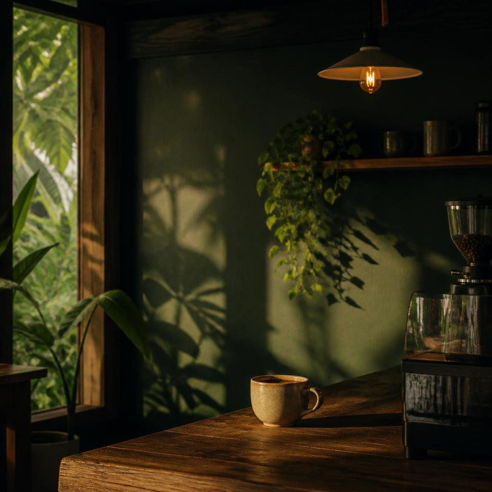
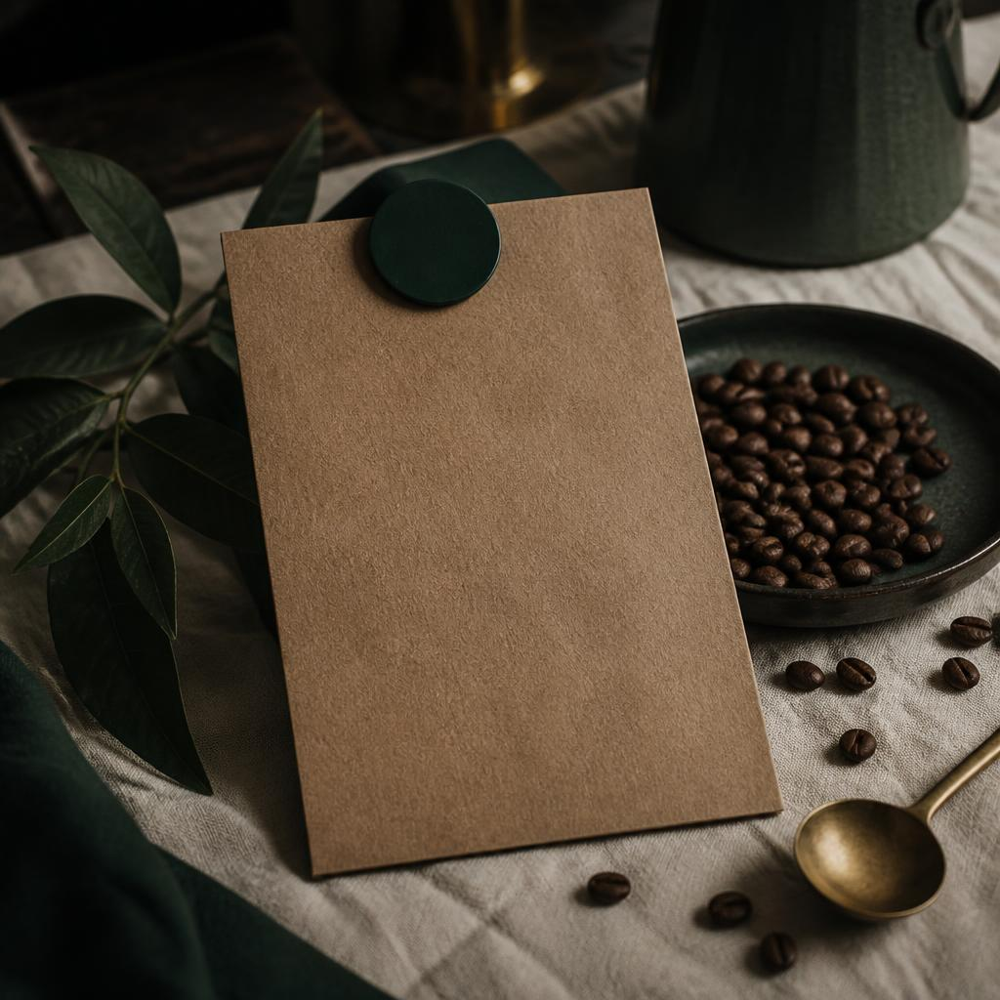

<div align="center">
  

  <h1>Luz y Amor</h1>
  <p><strong>Una mesa para volver a ti.</strong></p>
  <p>Cafetería costarricense · café de aquí · calidez para todos</p>
  
</div>

<br />

> Hay lugares que no se visitan: se vuelven parte de la rutina bonita.

Luz y Amor es una landing page estática construida para sentirse como abrir el cuaderno de una cafetería: fotografías cálidas, tipografía editorial, pequeños apuntes al margen y una navegación que acompaña sin interrumpir.

No es una plantilla de cafetería. Es una página hecha alrededor de una idea sencilla: que una taza también puede ser una forma de volver a casa.

## El recorrido

| Capítulo | Qué sucede |
| --- | --- |
| **01 · La casa** | La historia de Luz y Amor, su ritmo y su manera de recibir. |
| **02 · La carta** | Menú filtrable por cafés, bebidas, repostería, sándwiches y extras. |
| **03 · La confidencia** | Un menú secreto que aparece solo cuando el visitante decide preguntar. |
| **04 · La mesa** | Galería fotográfica con lightbox y navegación por teclado. |
| **05 · Ven a vernos** | Horario, Instagram, WhatsApp y ubicación. |

### Detalles que hacen la diferencia

- Navegación lateral tipo índice en escritorio.
- Menú móvil de pantalla completa y controles táctiles.
- Revelado progresivo al hacer scroll.
- Transiciones suaves con soporte para `prefers-reduced-motion`.
- Galería con zoom y cierre mediante `Escape`.
- WhatsApp con mensaje prellenado.
- Enlaces directos a Instagram y Google Maps.
- Diseño responsive pensado desde móvil, no solo reducido desde escritorio.

## Una mirada

<div align="center">
  <table>
    <tr>
      <td align="center">
        
        <br />
        <sub>La casa · luz, madera y café</sub>
      </td>
      <td align="center">
        
        <br />
        <sub>Los detalles · hecho aquí</sub>
      </td>
    </tr>
  </table>
</div>


## Estructura del proyecto

```text
├── index.html
├── .nojekyll
├── favicon.svg
├── assets/
├── images/
└── README.md
```

## Tecnologías

<p>
  
  
  
  
</p>

- **React + TypeScript** para la interfaz y el estado de las interacciones.
- **Vite** para desarrollo rápido y build estático.
- **CSS escrito para la experiencia**, sin una plantilla visual prefabricada.
- **Lucide React** para iconos ligeros y consistentes.
- **GitHub Pages** como destino de publicación.


## Sin backend. A propósito.

La página no necesita servidor, base de datos ni API de contenido. El menú, la galería y el menú secreto forman parte del sitio compilado; los únicos saltos externos son los enlaces de contacto y redes.


<div align="center">
  <br />
  <sub>Hecho con café, intención y un poco de luz.</sub>
</div>
